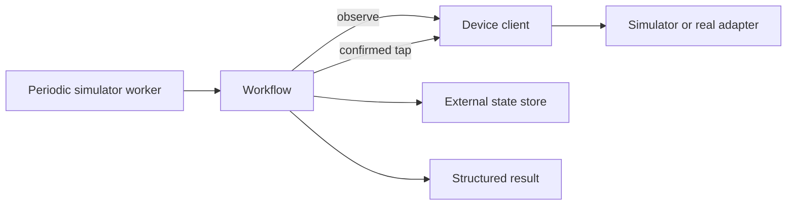

# Mobile automation control plane

A small, testable reference implementation for running durable mobile UI
automation safely. It models the parts that matter in a long-running automation
service: bounded recovery, confirmed actions, persistent state, and observable
results.

This repository intentionally contains no application-specific flows, real
screenshots, Android identifiers, accounts, credentials, or deployment access.
The accompanying production system is private.

See [Deploying the worker](deployment/README.md) for the reusable macOS Ansible
role, LaunchAgent, state migration, Vault configuration, log rotation, and an
inactive private CI/CD workflow example. The role deploys a persistent simulator
from this repository; no phone or production runner is needed.

## What it demonstrates

- A device interface that separates automation logic from ADB, Appium, or a
  simulator.
- A workflow that clicks only after confirming the expected state, then verifies
  its postcondition.
- Bounded retries and explicit `completed`, `unavailable`, and `failed` results.
- A JSON state store outside the source checkout, so updates do not erase
  operational cooldowns or history.
- Deterministic simulation tests that exercise happy paths and failures without
  a connected phone.

## Run it

Python 3.11 or newer is sufficient.

```bash
python -m pip install -e ".[dev]"
python examples/run_demo.py
python -m unittest discover -s tests
```

The demo opens a synthetic notification panel, claims a reward, confirms the
result, and stores the outcome in a temporary external state directory.

## Architecture



The production adapter can use ADB screenshots, OCR, and template matching. The
public project uses a deterministic simulator so the safety rules remain visible
and reviewable without exposing the target application.

## Design choices

An action is not considered successful because a coordinate was clicked. It must
observe its expected screen first and its expected result afterward. A missing
screen is `unavailable`; an ambiguous screen or missing postcondition is
`failed`. This makes failures diagnosable and avoids cascading input on an
unknown UI.

State belongs outside the source checkout. A service can update source code
without losing its action history, cooldowns, or last-known outcome.

## Portfolio notes

This project is paired with a private deployment that uses macOS launchd,
Ansible, external runtime state, dependency checks, and a hardware-backed mobile
device. The public project focuses on the reusable engineering ideas and gives
them a runnable, safe test harness.
